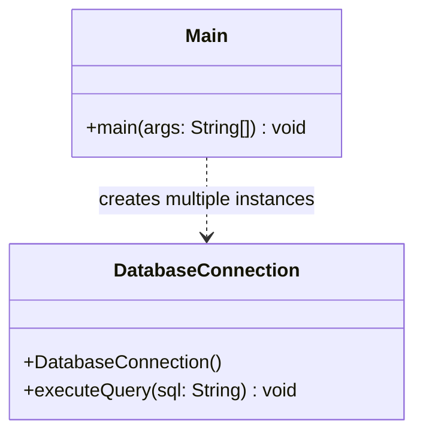
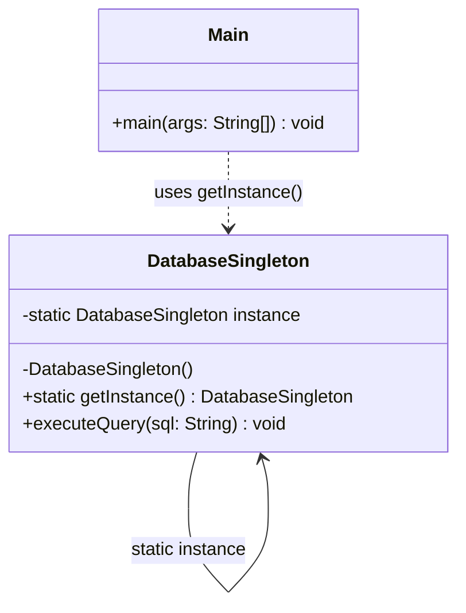
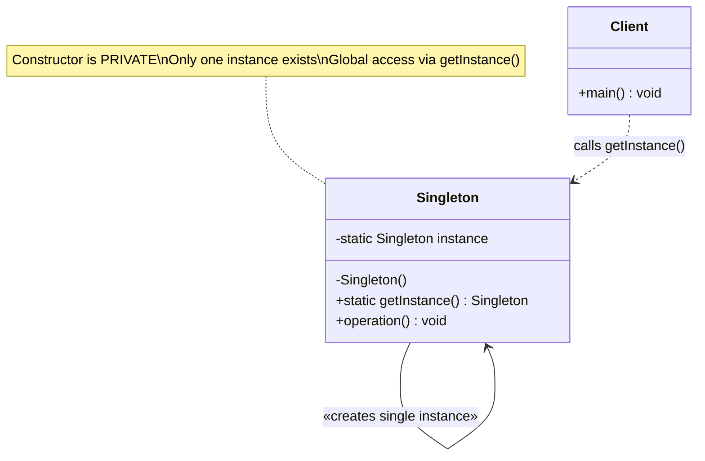

# Singleton Design Pattern — UML Class Diagram (Mermaid)

## Before (No Singleton — Multiple Instances)

## After (Singleton Pattern — Single Instance)

## Complete Singleton Pattern (Generic UML)

